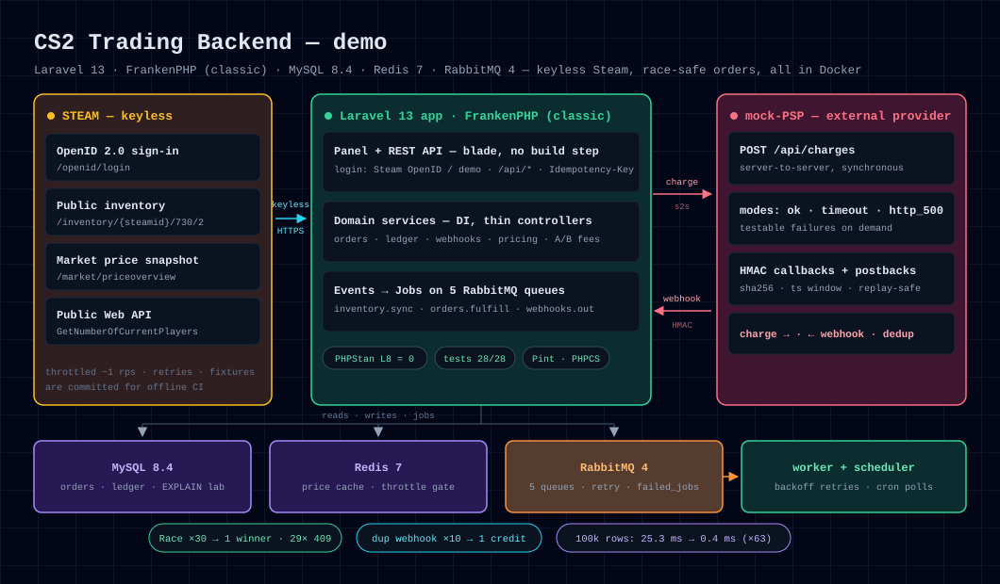
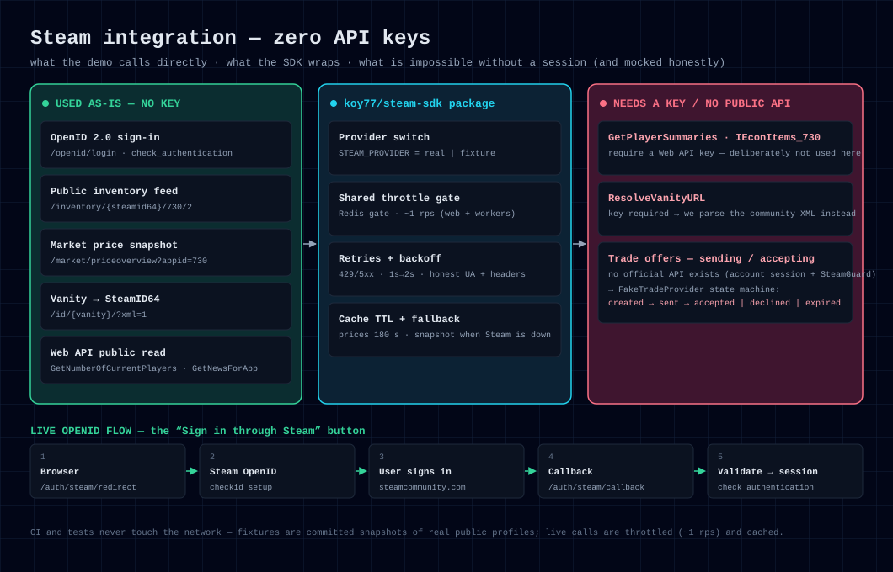
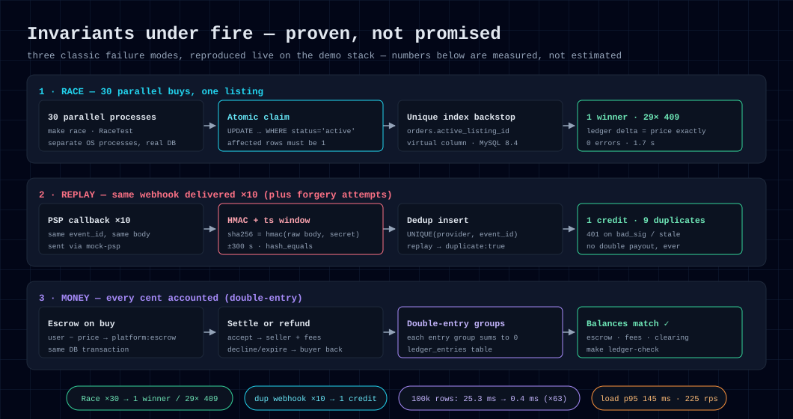
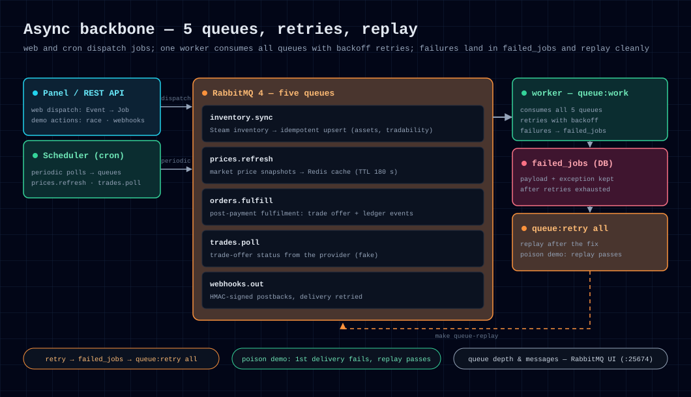
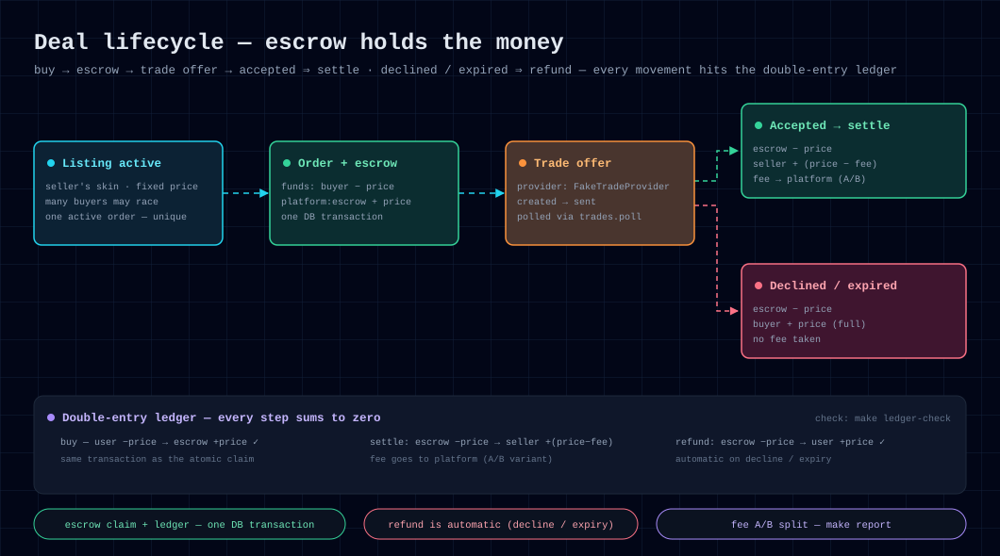
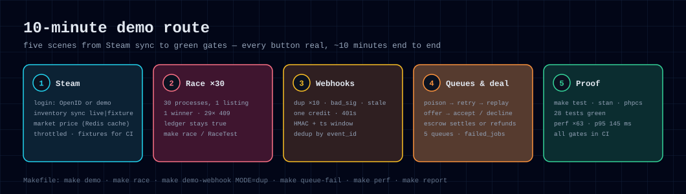

# CS2 Trading Backend — техническое демо

[](https://github.com/koy77/cs2-trading-backend/actions/workflows/ci.yml)


**🇷🇺 Русский** · [🇬🇧 English](README.en.md)

Backend-демо **торговой площадки CS2-скинов** на **Laravel 13**: вход через Steam и синхронизация
инвентаря **без единого API-ключа**, покупки, которые не ломаются под **реальной конкуренцией**,
**HMAC-вебхуки** платёжного провайдера с идемпотентностью, **RabbitMQ**, MySQL / Redis — всё в Docker.

Клонировать → `make demo` → кликать панель. Каждый пункт ниже — работающий артефакт, а не обещание.



---

## Что внутри (и где подводные камни)

| Область | Артефакт |
|---|---|
| **Steam без ключей** | Внутренний пакет [`koy77/steam-sdk`](packages/steam-sdk): Steam OpenID-вход, публичный фид инвентаря, цены Steam Market, публичный Web API. Переключатель провайдера `real ⇄ fixture`, общий троттлинг-гейт в Redis, ретраи. Ни одного API-ключа. |
| **Гонки** | `OrderService::buy()` — атомарный захват (`UPDATE ... WHERE status='active'`, проверка affected rows) + уникальный индекс по виртуальной колонке на активные заказы + ledger в одной транзакции. `make race` запускает N параллельных процессов: **ровно один победитель**; `tests/Feature/RaceTest.php` это доказывает. |
| **Платежи / вебхуки** | Сервис `mock-psp` эмулирует PSP (режимы `ok / timeout / http_500`). Входящие колбэки: HMAC-SHA256 по сырому body + окно timestamp + дедуп реплеев → зачисление ровно один раз. У пополнений — `Idempotency-Key` (ответы переигрываются). Исходящие postback'и: подписаны HMAC, ретраятся через очередь. Двойная запись: `make ledger-check`. |
| **Очереди** | RabbitMQ, 5 очередей (`inventory.sync`, `prices.refresh`, `orders.fulfill`, `trades.poll`, `webhooks.out`), ретраи с backoff, `failed_jobs` → `make queue-replay`. Кнопка «отравленного» сообщения в панели. |
| **MySQL / Redis** | Индексированная схема маркетплейса, разбор `EXPLAIN` (`make explain`), перф-лаборатория на 100k строк (`make perf`: сид → замер → индекс → замер), кэш цен в Redis с троттлингом. |
| **Гейты качества** | Pint, **PHPStan (Larastan) level 8 — ноль ошибок**, PHPCS (PSR-12), PHPUnit — 28 тестов, включая конкурентность и идемпотентность. Все гейты крутятся в GitHub Actions. |
| **AI-воркфлоу** | `CLAUDE.md` / `AGENTS.md`, slash-команды (`.claude/commands/`), PostToolUse-хук (авто-Pint), `.mcp.json` (read-only MySQL + fetch MCP), опциональный AI-ревью PR (`.github/workflows/ai-review.yml`). |
| **Ops** | FrankenPHP (classic mode, без NGINX/PHP-FPM — правки PHP применяются мгновенно), эндпоинт Prometheus `/metrics`, дашборд Grafana (профиль `monitoring`), лёгкий load-smoke (`make load-light`). |

---

## Быстрый старт

Нужны только Docker + Docker Compose (PHP / MySQL / Redis / RabbitMQ живут в контейнерах).

```bash
make demo        # .env + APP_KEY + build + up + migrate:fresh --seed + открыть панель
```

Панель: **http://localhost:18090** · RabbitMQ UI: http://localhost:25674 (cs2/secret) · Grafana: `make monitoring-up` → http://localhost:13001

Демо-логины (Steam-аккаунт не нужен): **kyle** (публичный инвентарь из фикстуры, 82 предмета), **outso**, **buyer** ($100 демо-баланса).
Живой Steam: кнопка «Войти через Steam» → настоящий Steam OpenID (без ключей).

### Шпаргалка

```bash
make help            # все команды
make up / down       # поднять / остановить стек
make fresh           # migrate:fresh + демо-сид (идемпотентно)
make test            # PHPUnit (база cs2_test)
make lint / stan / phpcs   # Pint / PHPStan L8 / PSR-12
make race            # ATTEMPTS=30 параллельных покупок → ровно один победитель
make demo-webhook MODE=dup   # один и тот же вебхук ×10 → зачислен один раз (valid|dup|bad_sig|stale)
make queue-fail / queue-replay / queue-flush  # «яд»: падение → failed_jobs → replay
make perf            # 100k строк: EXPLAIN до/после индекса
make explain         # EXPLAIN горячих запросов на свежей схеме
make load-light      # p95/rps смоук по /api/state
make report          # аналитика + A/B-комиссия
make ledger-check    # сходимость двойной записи
make monitoring-up   # профиль Prometheus + Grafana
```

---

## Steam без API-ключей



| Эндпоинт | Назначение | Нужен ключ |
|---|---|---|
| `steamcommunity.com/openid/login` | «Войти через Steam» → SteamID64 | нет (официальный) |
| `steamcommunity.com/inventory/{steamid}/730/2` | публичный инвентарь CS2 (assets, classid, имена, tradable-флаги) | нет |
| `steamcommunity.com/market/priceoverview?appid=730&...` | минимальная/медианная цена + объём по предмету | нет |
| `steamcommunity.com/id/{vanity}/?xml=1` | vanity → SteamID64, persona | нет |
| публичные методы `api.steampowered.com` (например, `GetNumberOfCurrentPlayers`, `GetNewsForApp`) | витрина статистики/новостей | нет |

Границы — честные по дизайну:

- `GetPlayerSummaries`, `ResolveVanityURL`, `IEconItems_730` → **требуют Web API key** (и здесь не нужны).
- **Создание/принятие трейд-офферов вообще не имеет публичного API** (нужна сессия аккаунта + SteamGuard).
  Поэтому жизненный цикл сделки идёт через интерфейс `TradeProvider` с `FakeTradeProvider`
  (`created → sent → accepted/declined/expired`) — и поэтому CI никогда не требует Steam-креденшелов.
- Community-эндпоинты Steam рейт-лимитятся и капризны к облачным IP — отсюда троттлинг, фикстуры
  и переключатель `real | fixture` (в репо закоммичены снапшоты реальных публичных профилей).

---

## Надёжность: гонки, вебхуки, ledger



- **Гонки.** 30 параллельных покупок одного листинга → ровно один заказ, остальные получают `409`.
  Атомарный claim + уникальный индекс-подстраховка + запись в ledger в одной транзакции.
- **Вебхуки.** HMAC по сырому телу, окно timestamp, дедуп по `(provider, event_id)`: один и тот же
  колбэк ×10 → одно зачисление; `bad_sig` / `stale` → `401`. Исходящие postback'и — с ретраями через очередь.
- **Деньги.** Двойная запись: каждая группа проводок сходится в ноль (`make ledger-check`).
- **Скорость.** 100k строк: 25.3 ms → 0.4 ms (×63) после индекса (`make perf`).

## Очереди и ретраи



- Пять очередей, включая идемпотентный `inventory.sync`, кэширующий `prices.refresh` и подписанные
  исходящие `webhooks.out`; воркер один — конкурентность отлаживается честно.
- Упавшая после ретраев джоба попадает в `failed_jobs`; `make queue-replay` возвращает её в работу —
  демо «отравленного» сообщения: первая доставка падает, повторная проходит.

## Жизненный цикл сделки



- Покупатель платит → деньги уходят в **escrow**; трейд-оффер создаётся через `TradeProvider`
  (`FakeTradeProvider`): `created → sent → accepted / declined / expired`.
- `accepted` → **settle**: продавец получает цену минус комиссию, комиссия уходит платформе.
- `declined` / `expired` → **возврат**: escrow возвращается покупателю полностью.
- Комиссия — A/B через Pennant (`make report` агрегирует сплиты).

---

## Сценарии демо (~10 минут)



1. **Steam и инвентарь** — вход, live/fixture-синк через очередь `inventory.sync`; рыночная цена предмета.
2. **Гонка** — `⚡ Гонка ×30` по одному листингу → ровно один заказ, остальным `409`; ledger сходится.
3. **Вебхуки** — `dup ×10`: один `event_id` десять раз → баланс меняется один раз; `bad_sig` / `stale` → 401.
4. **Очереди** — «отравленный» payload ×5 → ретраи → `failed_jobs` → replay; глубина видна в RabbitMQ UI.
5. **Сделка** — покупатель платит → оффер (fake) → продавец принимает/отклоняет/истекает → escrow рассчитывается или возвращается; Grafana показывает заказы/GMV/очереди.

---

## Стек и структура

**Стек:** PHP 8.4 · Laravel 13 · FrankenPHP (classic) · MySQL 8.4 · Redis 7 · RabbitMQ 4 · Docker Compose · PHPUnit / Pint / PHPStan L8 / PHPCS · Prometheus + Grafana.

```
app/                 Laravel-код: сервисы, джобы, контроллеры панели и API
packages/steam-sdk/  внутренний пакет: Steam OpenID / инвентарь / цены (keyless)
services/mock-psp/   эмулятор платёжного провайдера (ok / timeout / http_500)
database/            миграции + демо-сидеры
tests/               PHPUnit: гонки, вебхуки, ledger, SDK
assets/              SVG-диаграммы этого README
docker/ monitoring/  FrankenPHP-образ, Prometheus / Grafana
Makefile             весь жизненный цикл: make help
```

Для работы с AI-агентами в репо лежат `CLAUDE.md` / `AGENTS.md` / `.claude/` / `.mcp.json`.

## Лицензия

MIT. Steam и CS2 — товарные знаки Valve Corporation; это некоммерческое техническое демо, использующее только публично доступные данные.
